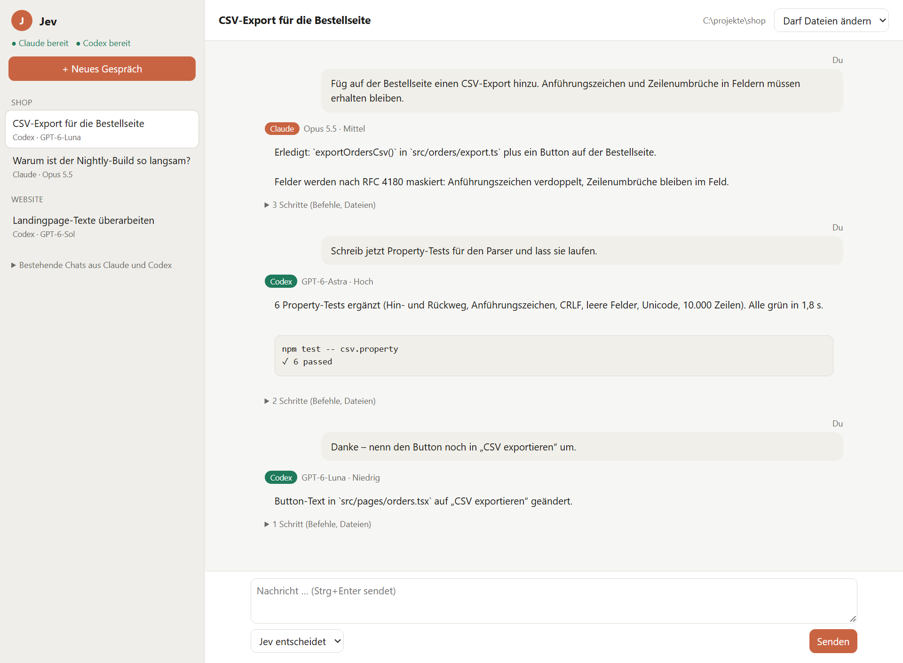

# Mindrails Supervisor

[](https://github.com/haskallalk-eng/mindrails-supervisor/actions/workflows/ci.yml)
[](LICENSE)


**Pick the right AI model and effort before an agent starts working – for Claude Code and Codex.**

Open-source tools around [Jev](https://typesafe.ai), a judgment model that answers fixed questions about a conversation with calibrated probabilities. Everything runs locally; Jev is called through your own Vercel AI Gateway key.

> **Status (October 2026): finished preview.** The project is complete as published and not actively developed further. It is shared as a working reference. Issues and pull requests are welcome, but there is no roadmap.



<sub>The Jev app with a sample conversation: Claude Code builds the export, Codex writes the tests, a small rename goes to the cheapest model.</sub>

## What's inside

| Part | What it does | Where |
| --- | --- | --- |
| **Jev plugin** for Claude Code and Codex | Before each new task Jev decides whether the message is a new task at all, then checks model and effort against published benchmarks and weighted community evidence. Fits: `✓`. One step off: a one-line hint plus a small on-screen figure. Two or more steps off: in the Claude desktop app the message **waits until you switch** in the menu, then runs by itself. | [`plugins/jev-claude`](plugins/jev-claude), [`plugins/jev-codex`](plugins/jev-codex) |
| **Jev app** (preview) | One local chat window for Claude Code *and* Codex. Jev picks agent, model and effort per message and starts the run with that setting. Switching agents mid-conversation hands over the history the new agent has not seen. | [`src/jev-app`](src/jev-app) |
| **Supervisor MCP server** | Completion gate, repeat-loop detection and trace triage for any MCP host. | [`src`](src), `dist/cli.js mcp` |
| **Codex review plugin** | Local chat monitor and optional end-of-turn Jev review for Codex. | [`plugins/jev-chat-review`](plugins/jev-chat-review) |

## Quick start

Requirements: Node.js 24+ (the plugins run on 20+), and for Jev itself an `AI_GATEWAY_API_KEY` from [Vercel AI Gateway](https://vercel.com/docs/ai-gateway) with **paid credits** (since late September 2026 the gateway no longer serves the Jev model to free-tier credits). Chat excerpts are sent to Jev and may incur small charges (fractions of a cent per check).

**Jev plugin – Claude Code**

```sh
claude plugin marketplace add haskallalk-eng/mindrails-supervisor
claude plugin install jev@mindrails
```

**Jev plugin – Codex**

```sh
codex plugin marketplace add haskallalk-eng/mindrails-supervisor --ref main
codex plugin add jev@mindrails
```

Then type `#jev an` once in a chat (`#jev hilfe` lists the commands; the plugin speaks German).

**Jev app**

```sh
git clone https://github.com/haskallalk-eng/mindrails-supervisor.git
cd mindrails-supervisor
npm ci --ignore-scripts && npm run build
node dist/jev-app/app.js --cwd /path/to/your/project
```

It drives the official `claude` CLI and `codex app-server` with **your own sign-ins** (run `claude` → `/login` once). Intended for personal use on your own machine.

**Supervisor demo (no account, no key)**

```sh
npm run demo
```

## How Jev chooses

1. **New task?** Jev answers a yes/no question about the message in the same request. Replies like "ok" or "go on" are left alone. There is no length rule in our code.
2. **Kind and difficulty.** Coding, agent/terminal, reasoning, research or simple; easy, normal or hard.
3. **Model.** A fixed policy compares published benchmarks ([sources](src/model-benchmarks.ts)) and a weighted spectrum of 668 practitioner statements ([method](docs/model-spectrum.md)). It switches only for a clear gain: at least 4 benchmark points, or at least 25 % lower cost per task at equal quality. Claude and Codex models are compared in one cost unit.
4. **Effort.** The level the evidence names for that model, one level more for hard tasks, never into the range rated "too much".

Details: [docs/model-routing.md](docs/model-routing.md).

## What it cannot do (tested)

- **Plugins cannot switch model or effort.** In the Claude desktop app (Claude Code 2.1.281) skill `model`/`effort` settings never reached the requests, and the app refuses to let a session re-price its own turns. Codex has no such interface at all. So the plugin recommends and waits; you switch. The Jev app can set both because it starts the runs itself.
- **The on-screen figure is Windows-only** and sits at the window's bottom-right corner, not exactly on the menu.
- **Codex:** the effort is only known from the conversation history, so a message two or more steps off is held once instead of waiting; sending again lets it through.
- **Jev app:** it never writes into a chat that is open in the Claude or Codex app; a handover is text, not the other agent's native tool history. The Claude side is tested against a stand-in CLI and the Codex side live.
- **No accuracy guarantee.** Benchmarks and community evidence are snapshots (September 2026); thresholds are initial policy defaults.

## Tests

132 automated tests (policy, hooks, plugins, the app with fake Claude and Codex binaries, real MCP transport) run on Ubuntu and Windows in CI. Live checks against the real services are documented in [`evidence/`](evidence) and the [changelog](CHANGELOG.md).

---

## Supervisor MCP server

A local MCP completion gate for AI agents, with optional Jev judgments and deterministic policies.

An independent open-source project by [Mindrails](https://mindrails.de).

**Earlier experiments: route before execution.** The separate local `jev` command asks Jev to choose between the available GPT-6 Astra, Sol and Luna models, then starts Codex with the highest-probability model. Run `npm run build`, `npm link`, then `jev --workspace-write` in your project. Each input is routed before execution; subsequent inputs include visible conversation history. New: `jev-panel` serves a small side panel (open it in Codex's in-app browser) that routes and continues a chosen conversation, with long-history selection, visible probabilities and approvals. This does **not** intercept the Codex desktop chat composer, and it cannot write to a conversation while the Codex app has it open. See [setup, failure behavior and limitations](docs/model-routing.md). This preflight argmax policy is separate from the plugin's advisory uncertainty policy below.

Check explicit requirements before an agent stops, and flag repeated steps. The host remains responsible for verification, permissions and execution.

**Jev recovery advice:** the optional Codex review now asks three additional focused questions in the same request: is the current work advancing, what is the dominant unresolved obstacle, and what next step fits? When the answers agree with sufficient confidence and selected probability, Mindrails presents a prepared follow-up prompt: resolve a prerequisite, ask for a missing decision, change approach, verify the result, or correct a missed requirement. Productive work gets no recovery interruption. Conflicts and uncertainty produce no action prompt; an environment blocker suppresses a contradictory model-upgrade suggestion. Jev classifies; application code selects the fixed wording. Prompts are never dispatched automatically.

See [the Jev-specific product comparison and validation plan](docs/jev-product-direction.md). This is a development preview; uniqueness, productivity gains and semantic accuracy have not been established.

**Uncertainty policy:** an unclear intervention preserves the host's normal path (`CONTINUE_BASELINE` / recovery `action: none`) without confirming completion. An uncertain downgrade keeps the current model; a plausible but uncertain upgrade prefers stronger-model advice under a documented quality-first rule. Fallback advice is labeled as product policy, not a confident Jev diagnosis. Clearly identified prerequisites override model changes, and clear failures remain visible. The plugin does not automatically interrupt, restart or switch a task.

### Try the free offline demo

Requires Node.js 24 or later and npm. No account or API key is needed.

```sh
git clone https://github.com/haskallalk-eng/mindrails-supervisor.git
cd mindrails-supervisor
npm ci --ignore-scripts
npm run build
npm run demo
```

Actual synthetic demo output:

```text
SYNTHETIC MOCK DEMO — no API call, no semantic evaluation
3/5 markers → CONTINUE license, security
5/5 markers → FINISH
3 repeated steps → REVIEW
changed result → CONTINUE
```

Mock mode uses explicit `[done:id]` markers and supplied fixture evidence. It demonstrates policy mechanics, not model accuracy. A Jev failure never falls back to mock.

### CLI and host loop

```sh
node examples/agent-loop.mjs
npm run e2e
npm run evidence
```

For a direct check, select the provider explicitly. Unix: `MINDRAILS_PROVIDER=mock node dist/cli.js check examples/check.json`. PowerShell: `$env:MINDRAILS_PROVIDER='mock'; node dist/cli.js check examples/check.json`. Trace triage is available as `MINDRAILS_PROVIDER=mock node dist/cli.js triage examples/trace.json`. The `stuck` command is deterministic and needs no provider.

`check <file.json>` returns an advisory decision. `stuck <file.json>` accepts `{ "steps": [{ "action": "search", "input": "q", "result": "same", "progress": false }] }`. Exit status 0 means the evaluation was returned successfully, including `continue` or `review`; the host must inspect `decision`. Invalid input/startup uses exit status 1.

### MCP tools

| Tool | Input | Result |
| --- | --- | --- |
| `check_completion` | task, currentResult, 1–20 unique requirements; optional evidence, evidenceMode and trustedChecks | finish / continue / review, reason codes, missing requirement IDs, raw model signals and provenance |
| `detect_stuck` | Up to 50 caller-supplied action/input/result/progress steps; optional `allowedExtraRepetitions` from 0–2 | At least three trailing repetitions of a one-to-three-step cycle, with zero-based matched indices |
| `triage_agent_run` | task, instructions, up to 120 transcript turns, up to 50 tool calls, final message, optional feedback/action claims and current model plus Codex usage telemetry | CONTINUE_BASELINE / AUTO_CLOSE / HUMAN_REVIEW / PRIORITY_REVIEW / FILE_ISSUE / ROUTE_PAGE_ON_CALL, reason codes, labels, provider usage, and (when current model is known) a confidence-rated keep/upgrade/faster/uncertain model-fit direction |

Trace triage asks Jev three fixed-choice questions: whether the task appears complete, whether the user explicitly accepts or rejects the result, and whether the run is healthy, misses expectations, overtly fails, or claims success without support. A deterministic policy maps those labels to a recommendation. Low confidence or uncertainty preserve the baseline without certifying success; clear dissatisfaction or an expectation gap warrant review; a silent failure is prioritized; a clear failure is recommended for issue filing. Caller-reported unpermitted actions bypass Jev and are recommended for on-call review. These labels are initial heuristics, not validated production thresholds. Recommendations are advisory and never run tools, close work, create issues, page anyone, or authorize actions.

The trace, transcript, tool arguments and results are caller supplied and treated as untrusted data. Permission claims are not independently verified. Mock mode uses explicit `[mock:...]` markers only and is synthetic; it does not assess real traces.

Completion requires every requirement and task signal to reach 0.85, and contradiction signal at most 0.1. By default `evidenceMode` is `artifact`: Jev judges whether the requested content appears in the supplied result and does not demand external proof just to confirm the artifact's contents. Set `evidenceMode` to `fact-check` when the task requires sources or verification; then global evidence or evidence on every requirement is mandatory, and Jev's evidence score must also reach 0.85. This score is not source authentication. Any declared `trustedChecks` entry with `fail` or `unknown` blocks completion. **Evidence mode and trusted-check statuses are caller-supplied, unauthenticated claims.** Use trusted host logic for consequential verification.

`finish` means this policy accepts the supplied information. It does not establish real-world success. Evidence is not fetched or independently verified. Thresholds are initial policy defaults, not calibrated guarantees. Changed results or reported progress interrupt repeat detection; four-step cycles, timestamp-changing errors and other semantic loops may go undetected. Repeat grace is caller supplied and cannot prove that polling is legitimate.

### MCP setup

Tested: official `@modelcontextprotocol/client` 2.0.0 over stdio. The following is a generic host configuration example; individual desktop hosts have not been tested:

```json
{
  "mcpServers": {
    "mindrails-supervisor": {
      "command": "node",
      "args": ["/absolute/path/to/mindrails-supervisor/dist/cli.js", "mcp"],
      "env": { "MINDRAILS_PROVIDER": "mock" }
    }
  }
}
```

On Windows use your absolute path with JSON-escaped backslashes. MCP results advise the host; this server cannot force it to continue, execute tools or switch its internal model.

### Automatic Jev review for Codex (local plugin preview)

The `plugins/jev-chat-review` package also monitors open Codex chats locally. Ask Jev to open the `open_codex_chats` overview for session status, elapsed time, repeated identical tool-call warnings, latest request token/context usage, and available Codex rate-limit pressure. Local monitoring stores derived signals only and makes no AI/API calls. At the end of a turn, the optional Jev review sends the bounded visible transcript, tool activity, current model, and usage evidence to Vercel AI Gateway. Jev then gives a confidence-rated model-fit direction when the current model is known: keep it, try a more capable model, try a faster model for comparable low-risk work, or uncertain. This advice does not change the selected model or claim measured cost savings. The feature requires `AI_GATEWAY_API_KEY` and may incur charges. Local defaults cap use at 20 reviews and 350,000 trace bytes per UTC day, with duplicate invocations skipped. These limits reduce usage but do not guarantee a fixed dollar maximum. A Jev request can delay the end of a turn by up to eight seconds. Results are advisory; Jev never continues or closes work, creates issues, pages anyone, or takes actions. Codex has no supported persistent plugin icon/panel for this use case, and the monitor has no timer that interrupts a still-running tool. Set `MINDRAILS_JEV_AUTO_REVIEW=0` or disable the plugin to stop reviews.

The hook reads Codex's local transcript, redacts common credential patterns, and sends the trace to Vercel AI Gateway. This is not a guarantee that every secret or personal detail is detected. Codex's transcript format is not a stable interface. Oversized traces are reported as unreviewed instead of silently truncated. This is a local integration preview, not a published one-click install. See [`plugins/jev-chat-review/README.md`](plugins/jev-chat-review/README.md) for setup, data handling, and limits.

### Optional Jev mode (BYOK)

Set `MINDRAILS_PROVIDER=jev` and supply `TYPESAFE_API_KEY` through your host's secret environment. Then use the same commands. The optional official Vercel compatibility route uses `MINDRAILS_JEV_ROUTE=vercel-ai-gateway` with `AI_GATEWAY_API_KEY`. Provider selection is mandatory for `check`, `triage` and `mcp`, preventing an accidental synthetic default or billable default. Environment files are not loaded automatically. Do not put keys in committed configuration or command history.

Jev mode sends task, result, requirements and supplied evidence to the selected fixed HTTPS endpoint. Inference may incur charges under the selected account. The Apache license covers this software, not either service. See [TypeSafe's API](https://docs.typesafe.ai/api), [account terms](https://typesafe.ai/legal/mca), [data policies](https://docs.typesafe.ai/legal), and [Vercel's TypeSafe-compatible API](https://vercel.com/docs/ai-gateway/sdks-and-apis/typesafe). The native adapter pins `jev-1.13.0`; the gateway adapter pins Vercel's `typesafe-ai/jev` alias. Completion checks use Noul signals and trace triage uses choice signals. Both verify the returned model. A gateway result does not establish which native Jev version served the alias.

The initial twelve-case Jev run on 2026-09-23 returned `continue` for every case (7/12, same as an always-continue baseline). After separating artifact completion from optional source-backed fact-checking and lowering the initial signal threshold to 0.85, a follow-up run on the same hand-labeled cases scored 12/12 with no false finishes, false continues or provider errors. This is a tuned synthetic suite, not a production accuracy estimate; validate on held-out cases before relying on the gate. The run used 7,054 input tokens and its catalog-rate estimate was $0.00028216. See the [follow-up result](evidence/results/jev-live-vercel-2026-09-24.json), [initial result](evidence/results/jev-live-vercel-2026-09-23.json) and [method](docs/evidence.md).

A separate eight-case set was frozen before being sent to Jev and was not used for tuning: 7/8 correct, no false finishes, one false continue on a valid JSON artifact, and no provider errors. This suggests the policy errs conservatively on some structured outputs. We did not lower thresholds based on this held-out result. See the [held-out report](evidence/results/jev-heldout-vercel-2026-09-24.json).

### Limits and privacy

| Setting | Default | Scope |
| --- | --- | --- |
| MINDRAILS_MAX_CALLS | 100 | Attempts per running process, reserved before dispatch |
| MINDRAILS_MAX_INPUT_BYTES | 320000 | Cumulative serialized input bytes per process, not billed tokens |
| MINDRAILS_TIMEOUT_MS | 5000 | Total evaluation deadline including response read |
| Single input | 32000 bytes | Completion input after normalization |
| Jev request / response | 64000 bytes each | Serialized HTTP bodies |

No automatic retries. Failed attempts consume budget. Process restarts reset counters; these caps are not a durable financial spending limit. Each CLI command is a new process. The MCP server preserves counters while running. A caller with unbounded access can restart it; enforce durable quotas in your host.

No telemetry, disk trace storage, action execution, cloud service or model weights. CLI outputs include derived signals and IDs; host logs may store them. Inputs persist in memory during evaluation. TypeSafe's retention is governed separately and is not assumed to be zero. The server is advisory, not an authorization or prompt-injection security boundary.

### Development

```sh
npm run typecheck
npm test
npm pack
```

Tests cover policy vetoes, bounds, timeouts, malformed responses, budgets, loop detection, trace triage, CLI and actual MCP transport. `npm run e2e` prints eleven concrete official-client scenarios. `npm run evidence` reproduces the fixed completion comparison and deterministic-policy baselines. The datasets are synthetic; no production accuracy, cost savings or performance benchmark is claimed. See [evidence](docs/evidence.md), [architecture](docs/architecture.md), [provenance](docs/provenance.md), [security](SECURITY.md) and [contributing](CONTRIBUTING.md).

The supervisor server itself intentionally excludes hosted MCP, persistent run state, dashboards and automatic actions (routing lives in the Jev plugin and app). Feedback on incorrect decisions is welcome using synthetic or redacted examples. No npm registry publication is provided; use the repository or GitHub release package.

## Deutsch – Kurzfassung

Jev prüft vor jeder neuen Aufgabe, ob Modell und Effort passen (veröffentlichte Benchmarks plus gewichtete Erfahrungswerte). Passt alles: `✓`. Eine Stufe daneben: eine Zeile und die Jev-Figur unten rechts. Ab zwei Stufen wartet die Nachricht in der Claude-Desktop-App, bis du im Menü umstellst, und läuft dann von selbst los. Umstellen musst du selbst: Weder Claude noch Codex lassen Plugins Modell oder Effort ändern (live getestet). Die Jev-App startet Claude Code und Codex selbst und kann deshalb Modell und Effort pro Nachricht setzen.

| Eingabe | Wirkung |
|---|---|
| `#jev an [Text]` | Jev für diesen Chat einschalten; ein Text dahinter wird normal gesendet |
| `#jev aus [Text]` | Jev ausschalten |
| `#jev <Text>` | Text senden, Jev schaut einmal drauf |
| `#jev status` | aktuelle Einstellung, letzte Einschätzung und Grund |
| `#jev` / `#jev? <Frage>` | Chat analysieren / Ja-Nein-Frage zum Chat in % |
| `#jev figur an` / `aus` / `test` | Jev-Figur ein- oder ausschalten oder einmal zeigen |
| `#jev hilfe` | alle Befehle |

## License

New original code: [Apache-2.0](LICENSE). Dependencies retain their own licenses; see [NOTICE](NOTICE). This project is independent of TypeSafe and is not an official Jev product.
